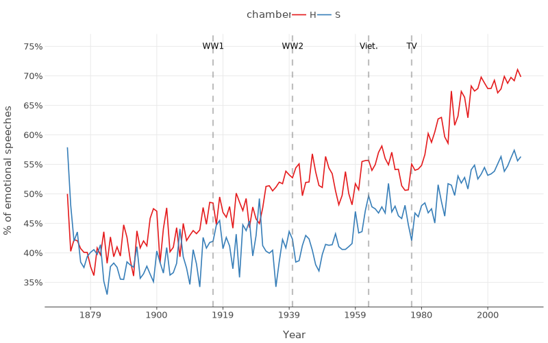

# Preference-based scoring model for political speech emotionality

_Author: Evžen Wybitul_


This project aims to replicate the analysis of the evolution of emotionality in congressional speeches from [Emotion and reason in political language](https://academic.oup.com/ej/article/132/643/1037/6490125) (G Gennaro and E. Ash, 2021). We use a new methodology based on a transformer scoring model, as opposed to the model based on single-words from the original study.

Our main result is the following timeline plot, which shows a proxy for the percentage of emotional speeches in different years. The main findings are very similar to the original study, and they even manage to recovers slightly more signal from the speeches, which gives us some evidence as to the utility of the new method. For a full report, please see [this document](assets/report.pdf).



## Assets

We pushed the different datasets and models to HuggingFace, to make it easier for others to follow up on the project, or do another analysis.

### Datasets

- [Eugleo/us-congressional-speeches](https://huggingface.co/datasets/Eugleo/us-congressional-speeches): An unmodified dataset of 17.4M speeches from 43rd-114th U.S. congresses. Simply a reformatted version of the [original dataset](https://data.stanford.edu/congress_text). Note that the speeches have been obtained with OCR and contain a lot of typos.
- [Eugleo/us-congressional-speeches-subset](https://huggingface.co/datasets/Eugleo/us-congressional-speeches-subset): Speeches from the original dataset that have roughly between 64 and 1024 tokens and do not contain prodecural ammendment comments. Contains 5M speeches.
- [Eugleo/us-congressional-speeches-emotionality-pairs](https://huggingface.co/datasets/Eugleo/us-congressional-speeches-emotionality-pairs): A dataset of 150k pairs of speeches from the subset dataset, with labels denoting which speech is more emotional generated by GPT-4o mini.

### Models

- [Eugleo/gemma-2-9b-emotionality](https://huggingface.co/models/Eugleo/gemma-2-9b-emotionality): A transformer model based on Gemma-2-9B trained to predict the emotionality score of a speech based on the preference-based dataset.Given the scores of two speeches, $x, y$, the difference between their scores $s(y) - s(x)$ should be interpreted as approximating the log-odds of $y$ being more emotional than $x$.

## Running the code

The project was setup using `pyenv` and `pdm`. If you don't use these tools, make sure you have Python 3.12 and install the dependencies from `pyproject.toml`. E.g. with `venv`,

```
python -m venv .venv
source .venv/bin/activate
pip install -e .
```

Depending on which parts of the analysis you want to run, you might need to create a `.env` file with the following variables:

```
# OpenAI API key, used to run GPT to obtain pairwise preferences
OPENAI_API_KEY=
# HuggingFace token, used to download and upload the dataset and the models
HF_TOKEN=
# WandB API key, used to log metrics when training the scoring model
WANDB_API_KEY=
```

Most of the code is contained in the `scripts` folder. If you want to replicate all of the results, you'll need to run the scripts in sequence:

1. `data_preprocess.py`: Parses the speeches and their metadata from the [original source](https://data.stanford.edu/congress_text), and pushes a combined dataset to HuggingFace.
    - You will need to download the `hein-bound.zip` from the [source website](https://data.stanford.edu/congress_text) and move the metadata txt files to `data/original/metadata` and the speech txt files to `data/original/speeches`.
2. `model_pairwise_labels.py`: Samples a given number of speech pairs from the HuggingFace dataset we created in the first step, and submits them to the OpenAI batch API to get preference-based labels about which speech in the pair is more emotional.
    - Run `python scripts/model_pairwise_labels.py submit` to create and submit the batch. This will create a new directory in `data/batch` that stores the batch metadata. It can take up to 24h for OpenAI to process the batch.
    - Run `python scripts/model_pairwise_labels.py download [data/batch/batch_1 data/batch/batch_2 ...]` to attempt to download the given batches. If all the batches have been completed, the script will download the results and push them to HuggingFace.
3. `model_train_classifier.py`: Trains a classifier to predict the emotionality of a speech based on the pairwise labels we obtained in the second step. Pushes the trained model to HuggingFace.
    - Run `python scripts/model_train_classifier.py` to train the classifier. This will create a new directory in `models` that stores the model metadata. It can take up to 24h for the model to train.
4. `model_score.py`: Uses the trained classifier to score a sample of the speeches from the dataset. Saves the results to `data/predictions/predictions.jsonl`.
5. `paper_plots.ipynb`: Generates the plots used in the paper. Downloads the different datasets from HuggingFace and loads `predictions.jsonl`, and saves the plots to `assets`.